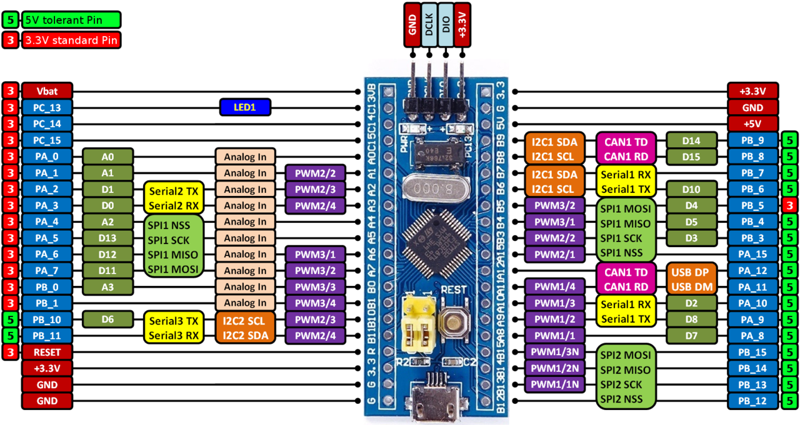

# BluePill board support for Mbed OS 6

This project is inspired by https://os.mbed.com/users/hudakz/code/mbed-os-bluepill/, but it's organized as a mbed
library to simplify its usage.

## Board description

### Board pinout

### Default pins

| description | pin |
|---|---|
| STDIO_UART_TX | PA_2 |
| STDIO_UART_RX | PA_3 |
| led pin (LED1 alias) | PC_13 |

### Mbed OS version support

| Mbed OS | status |
|---|---|
| 6.12 | Compiles and runs ok |
| 6.13 | Compiles and runs ok |

## Project configuration

After base mbed project creation and configuration perform the following configuration to setup board:

1. Go to project root directory.
2. Run `mbed add https://github.com/vznncv/TARGET_BLUEPILL_F103C8.git` to add this library to your project.
3. Copy `custom_target.json` from library folder to your project folder.
4. Run `mbed target TARGET_BLUEPILL_F103C8` command to set default board.
5. Run `mbed toolchain GCC_ARM` to set default toolchain.
6. Run `mbed export ...` command if you use IDE, as new files have been added to you project.

To program/debug you project, connect hardware debugger and optionally usb to serial adapter to pins PA_3, PA_2.

### Examples

Base examples can be found in the `examples` folder.

## License

Unless specifically indicated otherwise in a file, files are licensed under the MIT license.
